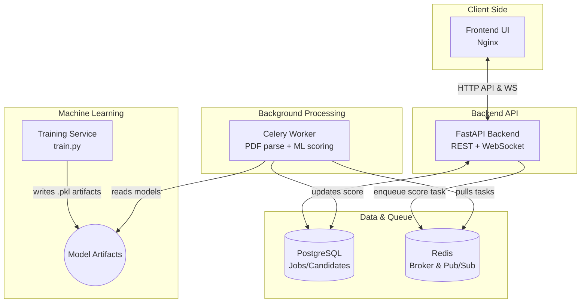

<div align="center">
  
# 🌟 Mini ATS (Dockerized)
  
**A modern, AI-powered Applicant Tracking System built with FastAPI, Celery, and Machine Learning.**

[](https://www.python.org)
[](https://fastapi.tiangolo.com)
[](https://www.docker.com/)
[](https://www.postgresql.org/)
[](https://redis.io/)
[](https://docs.celeryq.dev/)

</div>

---

## 🚀 Key Features

- 📝 **Job Management:** Create and manage job postings efficiently.
- 📄 **Smart Resume Parsing:** Upload multiple PDF resumes simultaneously.
- 🧠 **AI-Powered Scoring:** Asynchronous parsing and candidate scoring using Machine Learning.
- ⚡ **Real-time Updates:** Live ranking updates delivered straight to your dashboard over WebSockets.
- 🎯 **Decision Making:** Recruiter shortlist/reject decisions seamlessly integrated into the dashboard.
- 🐳 **Dockerized:** Reproducible full-stack deployment via Docker Compose.

---

## 🏗️ Architecture

The system is built on a robust microservices architecture using modern tools.



---

## 🧠 Machine Learning Models

Our intelligent scoring system leverages multiple ML models to find the perfect fit:

| Model | Type | Purpose | Artifact |
|:---|:---:|:---|:---|
| 🔠 **TF-IDF Vectorizer** | Text featurization | Convert JD and resume text to vectors | `vectorizer.pkl` |
| 🔮 **Logistic Regression** | Classification | Predict hire probability (0-1) | `classifier.pkl` |
| 📈 **Linear Regression** | Regression | Predict fit score (0-100) | `regressor.pkl` |
| 🧩 **KMeans (k=3)** | Clustering | Segment candidates into fit tiers | `kmeans.pkl` / `cluster_map.pkl` |
| ⚖️ **StandardScaler** | Feature scaling | Normalize numeric feature vectors | `scaler.pkl` |

**Features utilized for supervised learning:**
- 🔹 Cosine similarity (Job Description vs Resume TF-IDF)
- 🔹 Skill match score
- 🔹 Years of experience
- 🔹 Education level

---

## 📂 Project Structure

```text
📦 mini-ats
 ┣ 📂 training/          # ML model training service
 ┣ 📂 backend/           # FastAPI backend server
 ┣ 📂 frontend/          # Vanilla HTML/JS/CSS frontend served by Nginx
 ┣ 📜 docker-compose.yml # Container orchestration
 ┗ 📜 README.md          # Project documentation
```

---

## 🛠️ Quick Start (Run Everything)

Starting the entire project is incredibly easy thanks to Docker!

```bash
docker-compose up --build
```

**Services will be available at:**
- 🌐 **Frontend UI:** [http://localhost:3000](http://localhost:3000)
- 🔌 **Backend API Base:** `http://localhost:8000`
- 📚 **Interactive API Docs (Swagger):** [http://localhost:8000/docs](http://localhost:8000/docs)

---

## 💡 How to Use

1. **Access the Dashboard:** Open [http://localhost:3000](http://localhost:3000).
2. **Create a Job:** Navigate to the "Create Job" section and specify the role and requirements.
3. **Upload Candidates:** 
   - Go to "Upload Resumes".
   - Select the job you just created.
   - Provide candidate details and select multiple PDF resumes.
   - Click Upload.
4. **Monitor & Decide:**
   - Open the "Live Rankings" section.
   - Select the job to watch the table auto-refresh as candidates are processed and scored in real-time!
   - Mark top candidates as `shortlisted` and others as `rejected`.

**Status Flow Indicator:**
- ⏳ `pending` ➔ Candidate queued / scoring in progress
- ✅ `scored` ➔ Candidate successfully scored and ranked
- ❌ `error` ➔ Parsing or processing failure

---

## 📡 API Endpoints

| Method | Endpoint | Description |
|:---:|:---|:---|
| `POST` | `/jobs` | Create a new job vacancy |
| `GET` | `/jobs` | Retrieve a list of all jobs |
| `GET` | `/jobs/{job_id}` | Retrieve details of a specific job along with its candidates |
| `POST` | `/candidates/upload` | Upload a PDF resume and trigger the scoring queue |
| `GET` | `/candidates/{job_id}` | Retrieve all candidates for a job, sorted by fit score |
| `GET` | `/candidates/{job_id}/rankings`| Get ranked responses formatted for the live dashboard |
| `PATCH`| `/candidates/{candidate_id}/shortlist`| Update a recruiter's decision (`none` / `shortlisted` / `rejected`) |
| `WS` | `/ws/{job_id}` | Connect to WebSocket for live ranking updates |

---

## 📝 Important Notes

- 🎲 The `training` service will automatically generate a `dataset.csv` with 500 synthetic rows if one does not exist.
- 📦 Model artifacts are saved in the shared Docker volume `artifacts` to be consumed by the backend and worker.
- 📁 Uploaded PDFs are securely stored in the shared Docker volume `uploads`.
- 🔍 The background worker utilizes `pdfplumber` for robust PDF text extraction and asynchronously updates the PostgreSQL database.

---

## 🚑 Troubleshooting

- **Models aren't ready yet?** If the backend starts before model artifacts are generated, check the training service logs:
  ```bash
  docker-compose logs training
  ```
- **Want to see the AI magic?** Inspect the background worker while it scores PDFs:
  ```bash
  docker-compose logs -f worker
  ```
- **Need a clean slate?** Reset the entire environment, including all databases and uploaded files:
  ```bash
  docker-compose down -v
  ```

<div align="center">
  <i>Built with ❤️ using Python, Docker & AI</i>
</div>